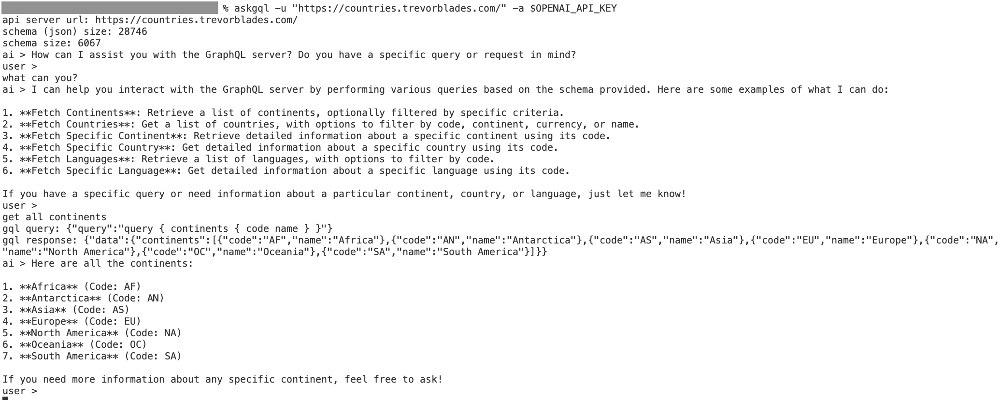

# AskGQL

AskGQL is a natural language interface for GraphQL servers.



## Usage

You need to have an OpenAI API key to use this tool. You can get one [here](https://platform.openai.com/signup).

Make sure that the GraphQL server supports introspection.

### Installation

```bash
cargo install --path .
```

### Run

```bash
askgql -u "https://countries.trevorblades.com/" -i "What is the official language of India?" -a $OPENAI_API_KEY
```

## License

MIT
